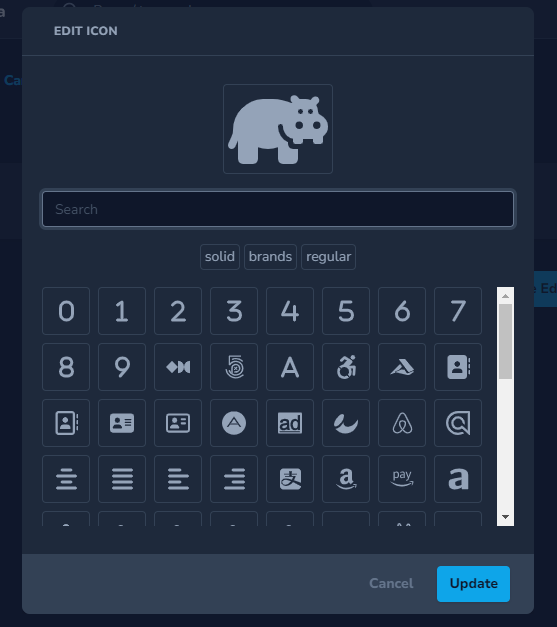
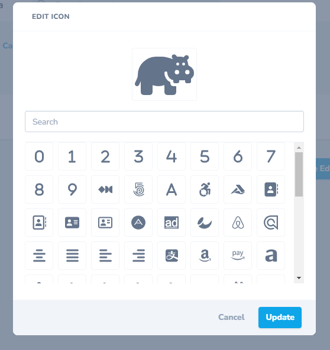
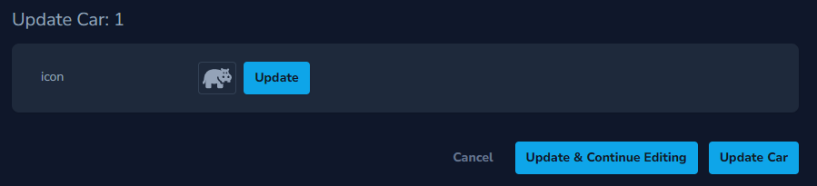
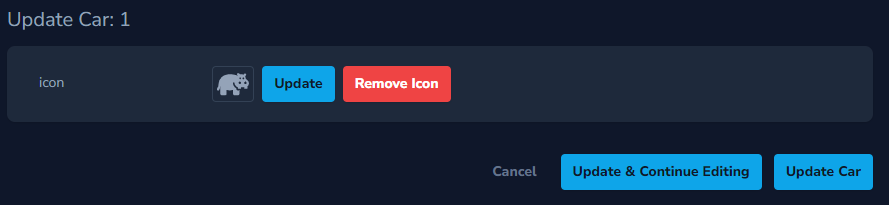
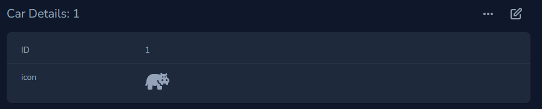
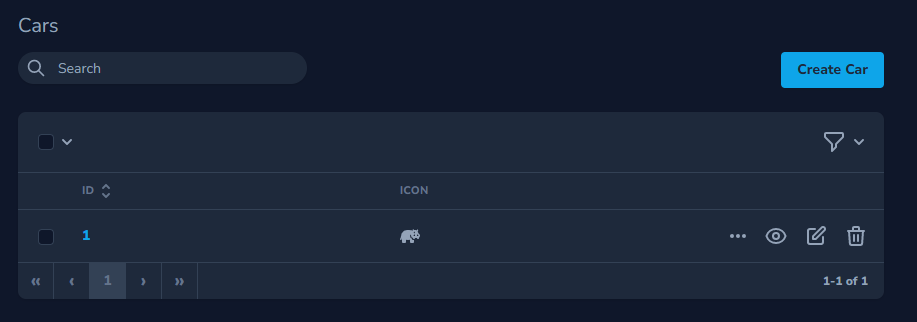

# Nova Font Awesome Field

A [Font Awesome](https://fontawesome.com) icon picker for [Laravel Nova](https://nova.laravel.com/).













## Install

```
composer require norman-huth/nova-font-awesome-field
```

## Usage

### Add the field.

```php
    /**
     * Get the fields displayed by the resource.
     *
     * @param NovaRequest $request
     * @return array
     */
    public function fields(NovaRequest $request): array
    {
        return [
            \NormanHuth\FontAwesomeField\FontAwesome::make(__('Icon'), 'icon'),
        ];
    }
```

### Optional: Publish Config

In the [config file](config/nova-font-awesome-field.php) you can specify the available Font Awesome styles and set default parameters for the field.

```
php artisan vendor:publish --provider="NormanHuth\FontAwesomeField\FieldServiceProvider" --tag="config"
```

### „Remove Icon“ Option

If the field is `nullable`, the function to remove the icon is also available.

````php
FontAwesome::make('icon')->nullable()
````

### Style Selector

To bypass the config settings use these methods.

#### Show Style Selector

````php
FontAwesome::make('icon')->showStyleSelector()
````

#### Hide Style Selector

````php
FontAwesome::make('icon')->hideStyleSelector()
````

### Translations

This package uses the global translations, so you don't have to maintain them multiple times.

#### Default Texts

````php
$this->texts = [
    'header'   => __('Edit Icon'),
    'cancel'   => __('Cancel'),
    'update'   => __('Update'),
    'search'   => __('Search'),
    'remove'   => __('Remove Icon'),
    'styles'   => __('Styles'),
    'more'     => __('Load more'),
    'null'     => __('No Icons Found'),
];
````

##### Change A Text

````php
use NormanHuth\FontAwesomeField\FontAwesome;

FontAwesome::make('icon')->setText('header', __('Edit Icon'))
FontAwesome::make('icon')->setText('cancel', __('Cancel'))
FontAwesome::make('icon')->setText('update', __('Update'))
FontAwesome::make('icon')->setText('search', __('Search'))
FontAwesome::make('icon')->setText('remove', __('Remove Icon'))
FontAwesome::make('icon')->setText('Styles', __('Styles'))
FontAwesome::make('icon')->setText('more', __('Load more'))
FontAwesome::make('icon')->setText('null', __('No Icons Found'))
````

### Icon Set

Default icons in this package: Font Awesome Free 6.4.0.

#### Use Other Version Or Font Awesome Pro

* Download the wanted Font Awesome package from the [Font Awesome Website](https://fontawesome.com/download)
* Copy the `metadata/icons.json` file to Your Laravel installation
* Change the `icon-file` path to Your `icons.json` in Your `config/nova-font-awesome-field.php` config file
* Optional, but recommended: Remove unnecessary elements from the `icons.json` with `php artisan nova-fa-field:shrink-icon-file` command
